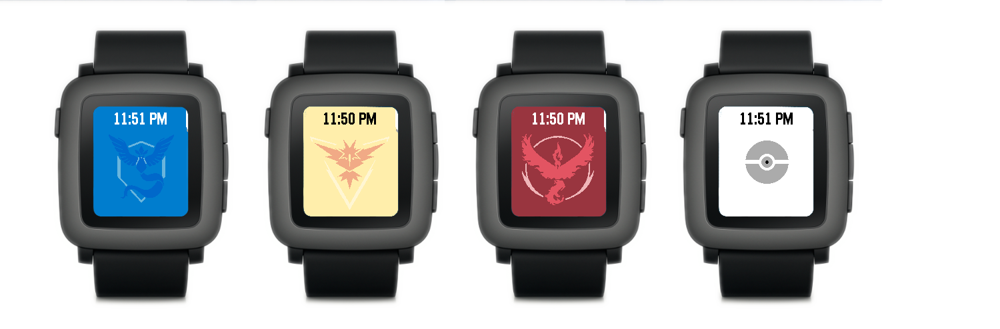
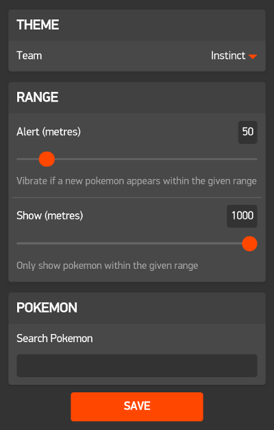
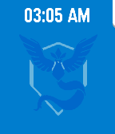
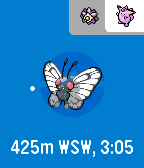

# PokeWatch
Pokemon Go tracker for Pebble Time, using pokevision.com.

Warning: This is an alpha release. Proceed with caution.

This repo is for both the [watchface](https://apps.getpebble.com/applications/5796959aa40d829e7b00001e) and [watchapp](https://apps.getpebble.com/en_US/application/5798e5b11482cdda2b0000c8) versions. The watchface version supports a subset of features of the watchapp, but is optimised for being always on (i.e actually useful as a watch). If in doubt, get the watchapp.

## HOW DO I GET IT
PokeWatch is available from the Pebble Appstore as a [watchface](https://apps.getpebble.com/applications/5796959aa40d829e7b00001e) or a [watchapp](https://apps.getpebble.com/en_US/application/5798e5b11482cdda2b0000c8), but you can also get it by [downloading the .pbw](https://github.com/tetrapus/PoGoPebble/releases/) and opening it with the Pebble app on your phone. The releases on GitHub are built for all pebble versions, but only tested on Pebble Time.

If the above method doesn't work, you can load it via CloudPebble as follows:

1. In the settings menu of your Pebble app, select "Enable developer mode".
2. A new "Developer Connection" menu item should appear. Turn on the developer connection by flipping the toggle switch.
3. Go to https://cloudpebble.net and sign in with your Pebble account.
4. Click "Import" and select "Import from Github"
5. Enter the following details:
  * Project Name: `PokeWatch`
  * Github Project: `github.com/tetrapus/PoGoPebble`
  * Branch: `watchapp` or `watchface`, depending on which you want to build
6. Click "Import"
7. Select "app.js" from the menu on the left and click the green play button in the upper right corner. This should upload and install the app to your Pebble.

## Configuration
The settings page lets you set your team and configure alerts and filters.

### Theme
It's vitally important that you set your team affiliation. This lets people passing by from rival teams know you're not to be messed with. For the best user experience, set your team to Mystic.

### Range
The range section lets you set the range for alerts and visibility.

Only pokemon which appear within the alert range will be able to trigger a vibration. Setting this to 0 disables all alerts.

### Pokemon
The pokemon section allows you to configure settings for each individual pokemon. Simply type the name of a pokemon and the settings pane for that pokemon will appear.
WARNING: Pressing enter will save the form. Tap on another element to apply the filter.

Hidden | If selected, the pokemon will never appear in the app.
Enable Alerts | If disabled, the pokemon will not trigger an alert even if it is in range.
Priority | The app will show pokemon of higher priority first. Priority for all pokemon defaults to 5.

## Interface
When no pokemon are present or the servers are down, the app will enter watch mode and show your team logo and the current time.

When pokemon appear, the logo will slide away to reveal the main interface:

The nearest pokemon with the highest priority will be shown as the active pokemon. If you want to track down a Pokemon, you can lock it in place, and the pokeball will change colour to indicate this. The small dot moving around the circumference of the pokeball is a compass (relative to north) indicating what direction the pokemon is in. The text below the pokemon shows information including distance, direction and despawn time, as well as current time and pokemon name - this differs between the watchface version and the watchapp.

The white bar in the top of the image indicates nearby pokemon. A grey background indicates it is either a higher priority or equal priority to the active pokemon, but closer.

### Watchface
The watchface by default displays the current time. To lock the active pokemon, shake the watch, and it will lock the pokemon and the current time will be replaced with location information. Shake again to reset this.

### Watchapp
The watchapp allows the following actions:
- Press the middle button to lock a pokemon in place
- Hold the middle button to dismiss a pokemon. You can reset dismissed pokemon by reloading the app.
- Press the up and down arrows to navigate through the list of nearby pokemon. Navigating will automatically lock the selected pokemon.
- Hold the up and down arrows to increase or decrease the priority of the current pokemon.
- Shake the watchface to toggle between pokemon location, pokemon name, and current date and time.

## Coming Soon
- Better presets for alerts and visible pokemon, including selecting by rarity
- Power saver mode
- Support for other pebbles
- Support for gyms and pokestops
- Compass Support
